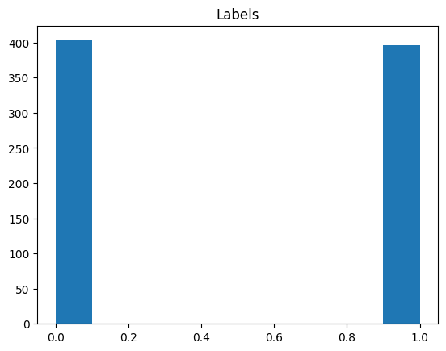
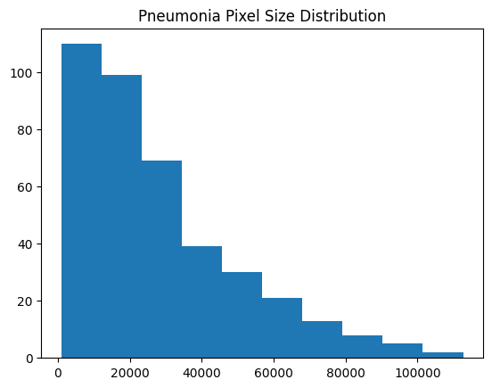
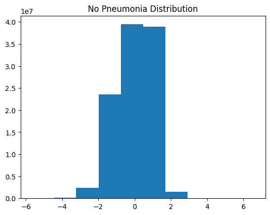
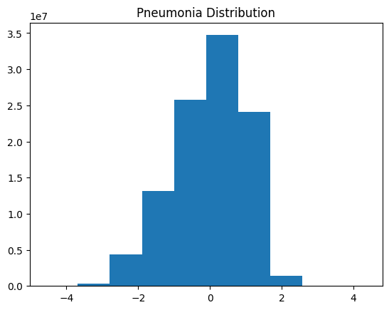
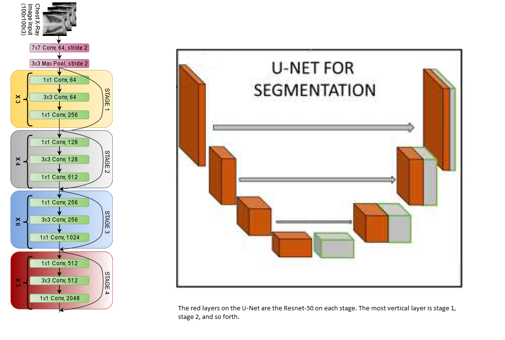
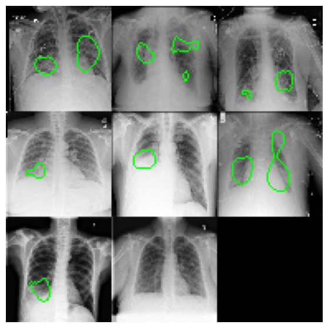
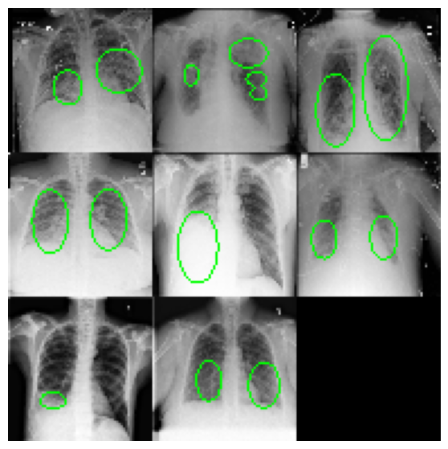

# Transfer-Learning with Resnet-50 onto U-Net
A project on using Transfer Learning to segment lung pneumonia. 

## 1.0 Motivation
Segmentation is costly to annotate. Requires someone with a degree of training to go through each slice and carefully contour what you're looking for. Given the recent event of COVID, pneumonia is only present as a serious complication of the case. This project is motivated to help patients by using machine learning to detect pneumonia. 

## 2.0 Data Exploration 
The image shows a chest X-ray where the pneumonia is encapsulated. Each image shape is [1, 512, 512, 1]. The first column is the z-axis, the second is the y-axis, the third is the x-axis, and the fourth is the channel. 

Checking the label distribution. About half of the cases have pneumonia, and the other half do not

    

Exploring the pneumonia pixel size distribution, it is right skewed, where most labels are around 20k pixels. The image total pixel is 512 x 512 = 262144. Most pneumonia cases cover about 7.6% of the overall image size. 

    

Lastly, check the chest image distribution with pneumonia and without pneumonia. 

    

    

There is a slight change in the distribution of cases with pneumonia against no pneumonia.

## 3.0 Transfer Learning and Preprocessing
The ResNet-50 backbone used for transfer learning in this experiment requires the following modifications:
- data input must be 2D (H X W) in shape
- data input must be 3 channels in depth
- data input must be scaled between [0, 1]

I preprocessed the data by subsampling by 8 to prevent potential overfitting. To keep the distribution the same, I added the minimum value for each slice to get the range between [0, max+min]. Then dividing the slice by max+min to get the value between [0, 1]. To create two additional channels, I simply tile the slice twice on the channel dimension to get size three. 

Then I loaded the pretrained Resnet-50 and did not include the top layer as we're appending a U-Net onto it. 

    

## 4.0 Building and Training The Model

The encoder (left portion) is the Resnet-50 of each stage in the image below. The decoder is a simple decoding U-Net layer. The output has values 0 (no pneumonia) and 1 (pneumonia). The model is trained on the cross entropy loss function. The code setup and the detail of the training Jupyter Notebook.

## 5.0 Results

The image quality dropped as we subsampled by 8 to reduce overfitting. The model was not the most accurate, but it has the general idea of where the pneumonia is located

The True Label Result:

    

The Model Prediction:

    

